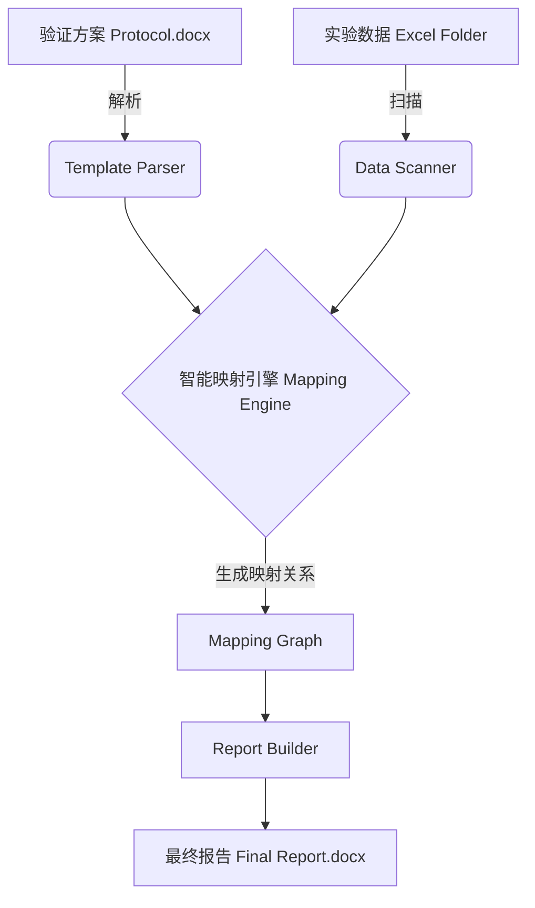

# 小分子非临床验证报告智能生成

## 1. 项目背景
目前非临床生物分析验证报告的撰写过程涉及大量的手工操作：
-   **输入源复杂**：包括Word格式的验证方案（Protocol）和几十个Excel格式的实验数据文件。
-   **数据映射繁琐**：Excel文件命名不统一（如 `表2_系统适用性` vs `表2_SST`），人工查找和对应耗时且易错。
-   **格式调整困难**：报告需遵循严格的排版要求（表格样式、小数位、单位等），手动复制粘贴效率极低。

## 2. 任务
构建一个智能报告生成系统，能够**自动解析**验证方案，**智能匹配**实验数据，并**自动组装**成符合排版要求的最终报告。
核心能力：**Self-Adaptive Mapping（自适应映射）** —— 系统不依赖死板的文件名规则，而是通过“语义理解”来找到数据源。

## 3. 核心流程与架构

### 3.1 系统数据流

### 3.2 核心模块设计

#### A. 模板解析器 (Template Parser)
-   **功能**：读取`Protocol.docx`，将其转化为“报告骨架树”（Report Skeleton Tree）。
-   **智能点**：
    -   识别章节标题（Heading 1-3），保留其层级结构。
    -   识别“占位符”区域：方案中描述“见表XX”的地方，即为数据的插入点。
    -   **元数据提取**：提取方案中的关键参数（如：LLOQ、ULOQ、化合物名称、内部控制限），作为后续数据的QC标准。

#### B. 数据扫描仪 (Data Scanner)
-   **功能**：遍历Excel文件夹，建立“数据资产库”。
-   **智能点**：
    -   **去文件名化**：不完全信任文件名。打开每个Excel，读取Sheet名称和首行内容（Title Cell）。
    -   **特征提取**：为每个Excel提取特征向量 `[Table ID, Title Keywords, Column Headers]`。
        -   例如：文件 `表2_SST.xlsx` -> 特征 `{ID: "Table 2", Keywords: ["System Suitability", "系统适用性"], Cols: ["Batch", "CV", "Retention Time"]}`

#### C. 智能映射引擎 (Mapping Engine) - *核心*
-   **算法逻辑**：双向模糊匹配
    1.  **ID匹配**：优先匹配表号（如：方案提到“表2”，数据中有“Table 2”或“表2”）。
    2.  **语义匹配**：如果表号不一致，计算方案章节标题与Excel标题的语义相似度（利用TF-IDF或Embedding）。
        -   matches("精度与准确度", "Accuracy and Precision") > Threshold
    3.  **结构验证**：检查Excel列头是否包含报告所需的关键指标（如：Mean, CV, Bias）。
-   **输出**：一个动态生成的映射表 `Mapping.json`，连接方案章节与具体Excel文件路径。

#### D. 报告构建器 (Report Builder)
-   **功能**：基于骨架和数据生成Word。
-   **样式引擎**：
    -   自动应用预设的三线表样式（顶线和底线加粗）。
    -   **智能修整**：自动根据有效数字规则修约数据（如：百分比保留1位小数，浓度保留3位有效数字）。
    -   **自动QC**：在插入数据时，对比方案中提取的“标准”，如果数据超标（如CV > 15%），自动标红并生成“偏差说明”草稿。

## 4. 详细功能需求

### 4.1 智能数据发现 (Smart Discovery)
系统应能处理以下差异情况且无需人工干预：
-   **中英文混用**：目录叫“稳定性”，文件叫“Stability”。
-   **文件名不规范**：文件名为`数据汇总_final_v2.xlsx`，但内容包含多个Sheet（表1, 表2...）。系统应能自动拆解（利用我们在Task 1中实现的Splitter逻辑）并索引内部Sheet。
-   **多层级目录**：文件散落在`Run7/Data`或`Reprocessed/Table`等深层目录中。

### 4.2 交互式映射确认 (Interactive Mapping Review)
在生成报告前，系统提供一个可视化界面供用户确认映射关系：
-   **左侧**：方案章节列表。
-   **右侧**：自动匹配到的Excel文件预览。
-   **操作**：如果匹配错误，用户可手动拖拽修正，系统将“记住”这次修正，优化下次算法。

### 4.3 异常处理与日志
-   **缺失报警**：如果方案中有“表5”，但数据库中未找到，生成“缺失数据清单”。
-   **格式错误**：如果Excel列名发生变化（如"CV"变成"RSD"），利用同义词库自动识别，识别失败则报警。

## 5. 实施路线图 (Roadmap)

-   **Phase 1: 基础建设 (Infrastructure)**
    -   完成Excel拆分与清洗脚本（已完成 ✅）。
    -   建立基础的Word和Excel解析库。

-   **Phase 2: 核心算法 (Core Algorithm)**
    -   开发“特征提取器”：从Excel中提取Title和Headers。
    -   开发“模糊匹配器”：实现ID+语义的混合匹配逻辑。

-   **Phase 3: 集成与验证 (Integration)**
    -   串联 Parser -> Matcher -> Builder 流程。
    -   使用 `NS...` 和 `SS...` 两个差异巨大的项目进行端到端测试。

-   **Phase 4: 界面与优化 (UI & Optimization)**
    -   开发简单的GUI或Web界面。
    -   引入用户反馈循环，优化匹配准确率。
